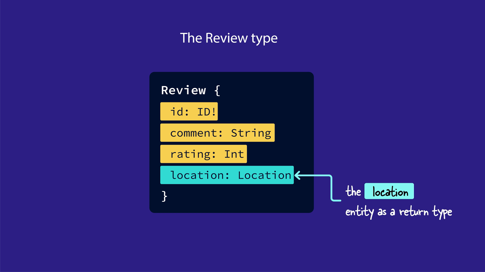

# Odyssey Voyage I

Voyage I: Federation from Day One
Learn how to modularize your GraphQL backend using Apollo Federation.


### What you'll learn

- The architecture of a supergraph (subgraphs and the router) and Apollo Federation 2

- Create and publish subgraph schemas

- Use the Rover CLI to interact with your supergraph

- Configure a locally-running GraphOS Router

- Create entities

- Use entities between subgraphs

---

### Table of Contents

- [Chapter 1: Intro to Federation](#chapter-1-intro-to-federation)
- [Chapter 2: Project Setup](#chapter-2-project-setup)
- [Chapter 3: Agreeing on a Schema](#chapter-3-agreeing-on-a-schema)
- [Chapter 4: Building Out the Subgraphs](#chapter-4-building-out-the-subgraphs)
- [Chapter 5: Managed Federation & the Supergraph](#chapter-5-managed-federation--the-supergraph)
- [Chapter 6: Publishing the Subgraphs with Rover](#chapter-6-publishing-the-subgraphs-with-rover)
- [Chapter 7: How the Router Resolves Data](#chapter-7-how-the-router-resolves-data)
- [Chapter 8: Router Configuration and Uplink](#chapter-8-router-configuration-and-uplink)
- [Chapter 9: Connecting Data Using Entities](#chapter-9-connecting-data-using-entities)
- [Chapter 10: Defining an Entity](#chapter-10-defining-an-entity)
- [Chapter 11: Entities and the Query Plan](#chapter-11-entities-and-the-query-plan)
- [Chapter 12: Referencing an Entity](#chapter-12-referencing-an-entity)
- [Chapter 13: Contributing to an Entity](#chapter-13-contributing-to-an-entity)
- [Chapter 14: Putting It All Together](#chapter-14-putting-it-all-together)

---

# Chapter 1: Intro to Federation

### Overview

Welcome to Voyage, a 3-part Odyssey series all about building a supergraph with Apollo Federation!

**Apollo Federation** is an architecture for creating modular graphs. That means that your graph is built in smaller pieces that all work together. When your graph is built using this architecture, it's called a supergraph. The supergraph improves the developer experience for teams, making it easier to scale your product.

To help build, manage and scale our supergraph safely, we'll use the Apollo GraphOS platform. We'll work with tools such as GraphOS Studio and the Rover CLI to bring our supergraph to life!

In this first course, we'll dip our toes into the world of federation. We'll explore what Apollo Federation is, why it's useful, and the key pieces of a supergraph architecture. Along the way, we'll put these concepts into practice by building a supergraph for a travel-review app called **FlyBy**.

Ready? Let's get started! In this lesson, we will:

- Specify how a supergraph differs from a non-federated graph
- Identify the key pieces of a supergraph architecture
- Explain the benefits of using a modular supergraph

> **Note**: This series is intended for backend developers.

> If you only work on the frontend, the good news is that your workflow stays the same, regardless of whether or not the backend uses Federation. You'll still send all your GraphQL operations to a single endpoint, and the supergraph will handle the rest!

### Life before Apollo Federation

Before we jump into the details of how to build a supergraph, let's take a step back and look at what life was like without Apollo Federation.

In a non-federated architecture, all the types and fields for your entire graph are represented by a single schema file on a GraphQL server.


When a client needs some data, it sends a GraphQL operation to the server. Then the server uses its schema, resolvers, and data sources to resolve the requested fields, package all the data together, and send it back to the client.


This works fine for smaller projects or teams, but what happens as your schema grows? As more types and fields get added to that one schema file, it becomes harder to manage. Backend teams may face more frequent merge conflicts and slower development time.

But don't worry! That's what Apollo Federation and the supergraph are here to fix.

> **Note**: You might hear the terms "supergraph" and "federated graph" used interchangeably. They mean the same thing: your graph's functionality is divided across smaller, modular graphs.

### The structure of a supergraph

Let's take a closer look at the structure of a supergraph. A supergraph has two key pieces:

- One or more subgraphs
- A router

### Subgraphs

In a supergraph, your schema is built in smaller parts. The division of these parts is usually based on domain or on which team manages that part of the schema.

The example below shows that we could split the schema into two pieces: one piece for fields related to products data (`name`, `numberInStock`, `price`) and another piece for fields related to events data (`date`, `attendees`, `venue`).


Each part of the schema is owned by a separate subgraph. A subgraph is a standalone GraphQL server with its own schema file, resolvers, and data sources.


> **Note**: If you've worked with a microservice architecture before, this might look familiar. You can think of subgraphs as a way to orient the design of your graph's schema around your microservice architecture.

### The router

A supergraph architecture also includes the router, which sits between clients and the subgraphs. The router is responsible for accepting incoming operations from clients and splitting them into smaller operations that can each be resolved by a single subgraph.


The router does this work with the help of the supergraph schema. The supergraph schema is composed of all the fields and types from each subgraph schema. (Later in the course, we'll dive deeper into composition and how the router resolves client requests.)

The supergraph schema is a bit like a map, helping the router determine which subgraph can resolve each field in an operation.

### Why use Apollo Federation?

With a supergraph architecture, nothing changes from the client perspective. They still communicate with a single GraphQL endpoint (the router), and they don't need to know a thing about how the graph is built under the hood.

The real benefits are on the backend. These benefits come from one of the core principles of Apollo Federation: the **separation of concerns**.

By splitting up our schema into subgraphs, backend teams can work on their own subgraphs independently, without impacting developers working on other subgraphs. And since each subgraph is a separate server, teams have the flexibility to choose the language, infrastructure, and policies that work best for them.


# Chapter 2: Project Setup

### Overview

Let's get our project set up! In this course, we'll play the role of a backend developer using Apollo Federation to build a supergraph for an app called FlyBy.

But first, let's imagine we've been transported far into the future, where everyone can traverse the galaxy for fun and adventure... and this is where FlyBy comes in.

In this lesson, we will:

- Explore the features of FlyBy, the demo app for this course
- Set up the FlyBy starter code

### What You'll Build: FlyBy

FlyBy is a web app that lets users review places they've visited on their intergalactic travels. They can browse a list of all the locations fellow space travelers have visited, see the details and reviews for each location, and submit reviews of their own.

Want a preview? You can explore the final version of the FlyBy app. https://odyssey-flyby.netlify.app/?_gl=1*hac8pm*_ga*ODA0NDg2MDMuMTcxOTkzMTU2Mg..*_ga_0BGG5V2W2K*MTcyMjQ1MzYyNi4zNi4xLjE3MjI0NTQ1MTcuMC4wLjA.


Like most apps, Flyby starts small. But by using a supergraph architecture right from the start, we can scale the FlyBy graph as the app and organization inevitably grow.

To build out the FlyBy supergraph, we will:

Publish two subgraphs: locations and reviews (Lessons 4-6)
Set up the GraphOS Router (Lessons 7-8)
Update the subgraphs to share types between them (Lessons 9-14)
See how everything fits together with the frontend (Lesson 14)
Let's get started!

Prerequisites
FlyBy uses Node.js on the backend and React on the frontend. We recommend using the latest LTS version of Node. To check your Node version, run node -v.

In this project we have two services: locations and reviews,

To create supergraph and combine this services to one we need to convert service to a subraph

1. need to isntall `npm install @apollo/subgraph`

2. Add this to .graphql file in your project `extend schema
@link(url: "https://specs.apollo.dev/federation/v2.0", import: ["@key"])`

3. import `const { buildSubgraphSchema } = require('@apollo/subgraph')`

4. Add `buildSubgraphSchema` to server configuration: `const server = new ApolloServer({
  schema: buildSubgraphSchema({ typeDefs, resolvers }),
});`

## Next step to create supergraph in Apollo Studio and publish our subgraphs

Let's start by spinning up a new supergraph for FlyBy.

1. Open a new browser window and go to GraphOS Studio(studio.apollographql.com
   ).

2. If you haven't created a graph in Studio before now, you'll can get started by clicking Connect a GraphQL API.

Otherwise, we can click the + Create New Graph button in the upper right corner of the Graphs tab.

studio.apollographql.com

3. We'll give our graph a descriptive title, keep the default settings for Graph Architecture as "Supergraph", then click Next.

Storing GraphOS environment variables
To publish our subgraphs using Rover, we'll need to save two environment variables from Studio:

APOLLO_KEY: An API key for authenticating Rover. It starts with something like service:your-graph-name.
APOLLO_GRAPH_REF: The graph reference (or graph ref) for our supergraph, which we'll use to tell Rover where to publish our subgraphs.
A graph ref starts with the graph's ID, followed by an @ symbol, followed by the graph variant.
We can get the values for APOLLO_KEY and APOLLO_GRAPH_REF out of the publishing options modal in Studio.

Go back to the configuration options in Studio that appeared after you created your supergraph. Make sure you're on the Schema Document tab.

First, make sure that the Supergraph Pipeline Track dropdown is set to Federation 2.7 Supergraph. This specifies that our supergraph should be built using the latest features of Apollo Federation.

Below, take a little peek at the command for publishing a subgraph schema. We'll be running this command shortly, but for now, we're more interested in the APOLLO_KEY environment variable here.

APOLLO_KEY=your-graphs-apollo-key \
rover subgraph publish your-graph-name@current \
 --name products --schema ./products-schema.graphql \
 --routing-url http://products.prod.svc.cluster.local:4001/graphql
Click on the eye icon on the code block to reveal the full value of APOLLO_KEY. Copy APOLLO_KEY and its value to your clipboard.

Back in our code editor, we'll create a new file in the router directory called .env.

Paste your APOLLO_KEY into router/.env.

router/.env
APOLLO_KEY=your-graphs-apollo-key
Now let's go back to Studio to get our graph ref. The value we're looking for appears in the same code block, directly after the "rover subgraph publish" part of the command. We'll copy this value onto our clipboard.

APOLLO_KEY=your-graphs-apollo-key \
 rover subgraph publish your-graph-name@current \
--name products --schema ./products-schema.graphql \
 --routing-url http://products.prod.svc.cluster.local:4001/graphql
Note: Our graph ref uses the current variant for our supergraph, which is the default variant. We'll talk more about variants in Voyage III: Federation in Production.

In your router/.env file, add a new line and set your APOLLO_GRAPH_REF environment variable:

router/.env
APOLLO_KEY=your-graphs-apollo-key
APOLLO_GRAPH_REF=your-graph-name@current

We've got the values we need to publish our subgraphs!

The rover subgraph publish command
Rover has a command ready to help us with this important task: rover subgraph publish. This command pushes the latest version of a single subgraph schema to GraphOS.

rover subgraph publish <APOLLO_GRAPH_REF> \
 --name <SUBGRAPH NAME> \
 --schema <SCHEMA FILE PATH> \
 --routing-url <ROUTING URL>
To use this command, we need the graph ref for the supergraph we want to publish to and the following command line options:

Option What is it?
--name What we want to call our subgraph in GraphOS
--schema The relative path to our subgraph's schema file
--routing-url The URL where our subgraph runs (locally, for now)
We'll fill in these options with the details for each of our subgraphs.

✏️ Publishing the locations subgraph
Let's see this command in action by publishing our locations subgraph.

Bounce back to the terminal and make sure we're in the root directory for the project.

Now let's type out the rover subgraph publish command:

We'll paste in the value of our APOLLO_GRAPH_REF environment variable.

For the name option, we'll pass in locations.

For the schema option, we'll pass the relative path to our locations.graphql file.

And for the routing-url option, we'll pass in localhost:4001.

rover subgraph publish <APOLLO_GRAPH_REF> \
 --name locations \
 --schema ./subgraph-locations/locations.graphql \
 --routing-url http://localhost:4001
Note: We've used the \ character in this command to improve legibility by putting each command-line option on its own line. If you choose to type the entire rover subgraph publish command on a single line, you don't need to include the \.

After running the command, you'll see the following message:

The host `localhost` is not routable via the public internet.
Continuing the publish will make this subgraph reachable in local environments only.
Would you still like to publish? [y/N]
Type in y to allow it. We're in tutorial land and working in local environments for now!

Note that you'll need to do this after every subgraph schema publish command.

If all is well in the world, running this command should output a message confirming that the subgraph has been published and the supergraph has been updated!

# Key takeaways

We can use the rover subgraph publish command from the Rover CLI to publish our subgraph schemas to the Apollo schema registry.
Whenever a new subgraph schema is published, GraphOS composes a new supergraph schema with any subgraphs registered to our supergraph.
The supergraph schema consolidates all the types and fields across our published subgraphs. It also includes extra directives to help the router determine which subgraphs can resolve each field.

`Client - request - Router (Supergraph Schema) - Subgraphs`

`[Client] <--Sends Queries/Mutations--> [Apollo Client]
[Apollo Client] <--Sends Requests--> [Apollo Gateway]
[Apollo Gateway] <--Forwards Queries--> [Service A (Apollo Server)]
[Apollo Gateway] <--Forwards Queries--> [Service B (Apollo Server)]
[Service A (Apollo Server)] <--Resolves Queries--> [Apollo Server]
[Service B (Apollo Server)] <--Resolves Queries--> [Apollo Server]
[Apollo Gateway] <--Schema Management--> [Apollo Studio]`

Router use supergraph schema to resolve incoming GraphQL operations from the client.

## Step 1: The client request

First, the client sends a GraphQL operation to the router. The client has no clue which fields belong to which subgraphs—or even that there are subgraphs at all!

```graphql
Client -> {
  query {
    field 1
    field 2
    field 3
  }
} -> Router
```


## Step 2: Building a query plan

Router checks query against supergraph schema


It uses this information to build a query plan, a list of smaller GraphQL operations to execute on the subgraphs. The query plan also specifies the order in which the subgraph operations need to run.


## Step 3: Executing the query plan

Next, the router carries out the query plan by sending the smaller GraphQL operations to each of the subgraphs it needs data from.


The subgraphs resolve the operations the same way as any other GraphQL server: they use their resolvers and data sources to retrieve and populate the requested data.

## Step 4: The subgraph responses

The subgraphs send back the requested data to the router, and then the router combines all those responses into a single JSON object.


## Step 5: Sending data back to the client

Finally, the router sends the final JSON object back to the client. And that's the end of our operation's journey!


## Recap

Here's the entire journey of a GraphQL operation through the supergraph, summarized in a single diagram:


## Key takeaways

- The router uses the supergraph schema to create a query plan for the incoming GraphQL operation. The query plan is a list of smaller operations the router can execute on different subgraphs to fully resolve the incoming operation.
- The router carries out the query plan by executing the list of operations on the appropriate subgraphs.
- The router combines all the responses from the subgraphs into a single JSON object, which it sends back to the client.

# Setting up the Apollo Router

In this lesson, we will:

- Set up the GraphOS Router locally
- Connect the router to GraphOS
- Send our first query to our supergraph

# Chapter 8: Router Configuration and Uplink

### Overview

> So far, FlyBy's subgraphs are running and their schemas have been published, but we still need one piece to tie everything together: the router.

In this lesson, we will:

- Set up the GraphOS Router locally
- Connect the router to GraphOS
- Send our first query to our supergraph

### Downloading the router

The GraphOS Router is a high-performance graph router available as an executable binary that you can add to your project in a few steps:

1. Open a terminal window and navigate to the router directory in the FlyBy project.

`cd router`

So far, we only have the `.env` file in here with our environment variables.

> 📦 router<br>
> ┣ 📄 .env

2. We'll download the Router by running the install command in the terminal.

`curl -sSL https://router.apollo.dev/download/nix/v1.46.0 | sh`

3. Now when we check the contents of our router directory, we'll see that we have a new file also called router!

> 📦 router<br>
> ┣ 📄 .env<br>
> ┗ 📄 router

### ✏️ Running the router

1. Back in the same terminal window, run the command below. You'll need to replace the <APOLLO_KEY> and <APOLLO_GRAPH_REF> placeholder values with your supergraph's corresponding values from the router/.env file. This command starts up the router locally and tells the router which supergraph to connect to.

`APOLLO_KEY=<APOLLO_KEY> APOLLO_GRAPH_REF=<APOLLO_GRAPH_REF> ./router`

2. We'll see a few lines of router output, and finally a message that our router is running on port 4000, ready to receive queries!

Let's copy this address, we'll need it to set our connection settings in Studio. This tells outside consumers of our API what endpoint they can use to query our schema.

`GraphQL endpoint exposed at http://127.0.0.1:4000/ 🚀`+

### ✏️ Connecting the router to GraphOS

Let's flip back over to Studio.

1. Click on the README tab in the sidebar.

2. Next, tap the Connection Settings link at the top of the page.


3. We'll paste the router address we copied (http://127.0.0.1:4000) as the endpoint, then save.


Let's get to querying our supergraph!

### ✏️ Testing our schema

1. Select the Explorer tab from the sidebar.

2. Let's put together a query that retrieves data from both of our subgraphs. We'll call our query `GetLocationsAndLatestReviews`.

3. Now let's fire in some fields. We'll start with `locations`. Click the plus button (⊕) next to Fields to add all the location fields to our query.

Next let's go back and add `latestReviews`, and all the reviews subfields.

Our query should look like this:

```graphql
query GetLocationsAndLatestReviews {
  locations {
    id
    name
    description
    photo
  }
  latestReviews {
    id
    comment
    rating
  }
}
```

4. Before we run the query, let's change the Response dropdown on the right to Query Plan Preview. This shows us a diagram for the query plan the router will use to resolve our current operation.


5. By choosing the icon to Show plan as text, we'll see a more detailed breakdown of the query plan. We won't worry about all the syntax here, but we can get a general idea of how the router plans to handle this query: the `locations` subgraph will resolve the `locations` fields, and the `reviews` subgraph will handle `latestReviews` and its subfields.


6. Now let's run this query.


### JSON response

```json
{
  "data": {
    "locations": [
      {
        "id": "loc-1",
        "name": "The Living Ocean of New Lemuria",
        "description": "Surviving is usually extremely difficult, especially when nutrients are scarce and you have to choose between growing or reproducing. One species on this planet has developed a nifty method to prepare for this. Once full matured, this species will split into 2 versions of itself and attached to each other, so it's essentially reproducing. Once those 2 are fully grown, they newly grown version will either detach itself if enough nutrients are available or it becomes a storage unit for the original, if nutrients are scarce. If nutrients continue to be scarce, the original will use slowly consume the nutrients in the new version in the hope that new nutrients become available again and it can repeat the cycle.",
        "photo": "https://res.cloudinary.com/apollographql/image/upload/v1644381344/odyssey/federation-course1/FlyBy%20illustrations/Landscape_4_lkmvlw.png"
      },
      {
        "id": "loc-2",
        "name": "Vinci",
        "description": "Many of the creatures on this planet have evolved into gliders, so to speak. Most of the fish and aquatic mammals, despite coming in various shapes and sizes, tend to glide through the water without effort, similar to how manta's glide on Earth. However, the surface species are more astonishing. Similar to the flying squirrels or the vultures of Earth, many of the species on this planet have developed ways to effortlessly move from one place to another by using the winds. But there is one species which shows signs of sentience. These species, a type of bird, love to play and have become masters of flight. Similar to how dolphins play, explore and learn, these species use their intellect and courage to play and sometimes challenge each other to death defying tricks.",
        "photo": "https://res.cloudinary.com/apollographql/image/upload/v1644381349/odyssey/federation-course1/FlyBy%20illustrations/Landscape_15_tiqel5.png"
      },
      {
        "id": "loc-3",
        "name": "Asteroid B-612",
        "description": "Nutrients are always needed but not always around, so organisms have to find ways to get them. Common ways are using different roots to find them in deep or shallow grounds or even stealing them from others, but on this planet many species have found a different balance. Unlike most plants on Earth who tend to only produce oxygen and nutrients, usually in the form of sugars, for itself, the organisms on this planet also produce other forms of nutrients for itself, usually for different purposes. These processes often lead to many byproducts which it doesn't need and are thus discarded. These discarded products are exactly what other species need to live and in turn produce byproducts it discards for the other organisms, leading to a delicate balance.",
        "photo": "https://res.cloudinary.com/apollographql/image/upload/v1644381343/odyssey/federation-course1/FlyBy%20illustrations/Landscape_6_vt6y3v.png"
      },
      {
        "id": "loc-4",
        "name": "Krypton",
        "description": "Similar to the surface, the underwater world has little more to offer than basic lifeforms. However, this planet has an astonishing water world. Almost everything is covered in a type of sea-grass. This grass varies in length depending on the region, but they're all part of the same species. But what's probably more surprising are the 'flowers' you'll find in these fields of sea-grass. These flowers can only be described as primitive soft corals, but they're neither coral nor plant.",
        "photo": "https://res.cloudinary.com/apollographql/image/upload/v1644381344/odyssey/federation-course1/FlyBy%20illustrations/Landscape_9_kbenjj.png"
      },
      {
        "id": "loc-5",
        "name": "Zenn-la",
        "description": "The plant-like organisms on this planet are made up of millions of flowers. Their combined colors and scents make for an amazing spectacle, but they leave little space for other species, which is why there are only very few bush and shrub species. Fungi, grasses and trees are non-existent.",
        "photo": "https://res.cloudinary.com/apollographql/image/upload/v1644381346/odyssey/federation-course1/FlyBy%20illustrations/Landscape_8_zd1e68.png"
      }
    ],
    "latestReviews": [
      {
        "id": "rev-8",
        "comment": "This is simply unbelievable! It's the perfect solution for our business. Really good. I don't always clop, but when I do, it's because of planet",
        "rating": 5
      },
      {
        "id": "rev-9",
        "comment": "Planet is exactly what our business has been lacking. It's incredible. If you want real marketing that works and effective implementation - planet's got you covered.",
        "rating": 5
      },
      {
        "id": "rev-10",
        "comment": "Thanks planet! I was amazed at the quality of planet. Planet did exactly what you said it does.",
        "rating": 5
      }
    ]
  }
}
```

> Fantastic! We can see that the data object in our response contains both locations and reviews.

> This is huge. We've just unlocked one of the powers of our supergraph: we can write one query to our router and hit both subgraphs at once!

# Chapter 9: Connecting Data Using Entities

### Overview

> The foundation of our supergraph is complete. We've separated FlyBy's schema into location data and review data, and we've implemented subgraphs that only define the types they're concerned with.

Revisiting our schema agreement checklist, we still have three fields that we don't know how to implement yet:

- `Location.reviewsForLocation` and `Location.overallRating`: These are both fields of the `Location` type, but we decided we want them to be owned by the `reviews` subgraph.
- `Review.location`: This is a field on the `Review` type (which lives in the `reviews` subgraph), but the field has a return type of `Location`, which is defined in the `locations` subgraph.


To implement these fields, we need to add a new tool to our developer tool belts: entities!

In this lesson, we will:

- Learn what an entity is and what it's used for
- Learn how to define an entity
- Learn how the router represents entities when it talks between subgraphs

### What's an entity?

An _entity_ is an object type with fields split between multiple subgraphs.

This means we can define a type that both of our subgraphs can contribute fields to and resolve independently.


In FlyBy, we want our `reviews` to include the `location` that they are written about. Our `Location` type needs to be used by both subgraphs, so we'll be turning the `Location` type into an _entity_.

A subgraph that defines an _entity_ can do one or both of the following:

1. Reference the entity
2. Contribute fields to the entity

### Reference the entity

Referencing an _entity_ means using it as a return type for another field defined in the subgraph.

For example, in the `reviews` subgraph, we can add a `location` field to the `Review` type, which will reference the `Location` _entity_ as its return type.



### Contribute fields to the entity

Contributing fields to an entity means that one subgraph adds new fields to an entity that are specific to that subgraph's concerns.

For example, the `Location` entity will have fields for name, description, and photo, which will live in the `locations` subgraph. In other words, the `locations` subgraph contributes these fields to the `Location` entity.

And the `reviews` subgraph contributes two review-specific fields to the `Location` entity: `reviewsForLocation` and `overallRating`.


## How to create an entity

To convert an object into an entity in the subgraph schema, we need to do two things:

1. Define a primary key
2. Define a reference resolver

### Defining a primary key

An entity's primary key is the field (or fields) that can uniquely identify an instance of that entity within a subgraph. The router uses primary keys to collect data from across multiple subgraphs and associate it with a single entity instance.

For example, a location entity's primary key is its id. The router uses that id to collect data about a specific location instance, like a location with id "loc-1".


In each of our subgraph schemas, we can define a primary key for an entity, by adding the `@key` directive after the type's name.

The `@key` directive needs a property called `fields`, which we'll set to the field we want to use as the entity's primary key.


## Defining a reference resolver function

Each subgraph that contributes fields to an entity also needs to define a special resolver function for that entity called a `reference resolver`. The router uses `reference resolver` to directly access the entity fields that each subgraph contributes.


Every reference resolver has the name: `__resolveReference`. We define each entity's reference resolver right alongside all the field resolvers for that type.

The `__resolveReference` function has a slightly different signature from other resolver functions. Instead of the usual four arguments, `__resolveReference` only takes three:

- `reference`: The entity representation object that's passed in by the router. This tells the subgraph which instance of an entity is being requested. We'll cover what an entity representation is in the section below.
- `context`: The object shared across all resolvers. (This is the same as in normal resolvers, but note that by convention, we refer to this `__resolveReference` argument as `context`, rather than `contextValue` as in other resolvers!)
- `info`: Contains information about the operation's execution state, just like in a normal resolver. We won't use this argument much.


Let's focus on this first argument, `reference`, and learn more about entity representations.

### What's an entity representation?

An `entity representation` is an object that the router uses to represent a specific instance of an entity. A representation always includes the `typename` for that entity and the `@key` field for the specific instance.

- The `__typename` field: This field exists on all GraphQL types automatically. It always returns the name of its containing type, as a string. For example, `Location.__typename` returns
  "Location".
- The `@key` field: The key-value pair that a subgraph can use to identify the instance of an entity. For example, if we defined the `Location` entity using the "id" field as a primary key, then our entity representation would include an "id" property with a value like "loc-2".

An entity representation for a location might look like this:


You can think of an entity representation as a passport that the router uses to refer to a particular object between subgraphs.

The typename field is like a passport's country of origin. It says which entity the object belongs to. And the `@key` field is like a passport's ID number, uniquely identifying this instance of that entity.


### Key takeaways

- An entity is a type that can resolve its fields across multiple subgraphs.
- To create an entity, we can use the `@key` directive to specify which field(s) can uniquely identify an object of that type.
- We can use entities in two ways:
  - As a return type for a field (referencing an entity).
  - Defining fields for an entity from multiple subgraphs (contributing to an entity).

* Any subgraph that contributes fields to an entity needs to define a reference resolver function for that entity. This `__resolveReference` resolver is called whenever the router needs to access fields of the entity from within another subgraph.
* An entity representation is an object that the router uses to represent a specific instance of an entity. It includes the entity's type and its key field(s).

# Chapter 10: Defining an Entity

### Overview

Let's jump into the code!

In this lesson, we will:

- Convert the Location type into an entity that can be shared between our subgraphs
- Publish updates to existing subgraphs

# ✏️ Defining the `Location` entity's `@key`

1.Open up the `subgraph-locations/locations.graphql` file and find the `Location` type.


2. We'll add the `@key` directive to this type definition, specifying the `fields` property and setting its value to `id`.


## Check changes in Sandbox

Let's test our changes. Open up http://localhost:4001 in your browser and use Sandbox to query our server again.

In the Documentation tab, we should now see that there's a new field on the Query type called `_entities`. This is a special field that the router uses for coordinating data between subgraphs. We'll learn how exactly the router uses this field in the next lesson.


Other than that, not much has changed! We should still be able to use Explorer to query the `locations` subgraph as before. (Try running a quick query for some data on the `locations` field, to make sure everything still works as expected.)

### Publish the `locations` subgraph

We'll need to publish this subgraph so that the schema registry can pick up our changes.

Let's make sure we're in the top-level directory of our project when we run the `rover subgraph publish` command in the terminal.


We can omit the `--routing-url` option in the command because we already set that value the first time we published the subgraph to the registry.

Great, it looks like our changes have been published successfully!

# ✏️ Defining our entity in `reviews`

We want to use the `Location` entity in our `reviews` subgraph as well.

1. Open up the `subgraph-reviews/reviews.graphql` file.
2. We'll add the Location type definition, along with the @key directive and set the id field as the primary key.


3. Inside the curly braces, we'll add the id field of type non-nullable ID!.


The `Location` entity doesn't need to include all the fields we defined for it in the `locations` subgraph. After all, the `reviews` subgraph doesn't know anything about these fields, or how to resolve them!

So far, we've given our `reviews` subgraph a stub of the `Location` entity. A stub serves as a basic representation of a type that includes just enough information to work with that type in the subgraph.

There's one more change we need to make. Because the `reviews` subgraph is not responsible for resolving any of the entity's other fields, we'll add one more property to our `@key` directive.

4. Inside the `@key` directive, add a property called `resolvable` and set it to `false`.


This property tells the router that this subgraph doesn't define a reference resolver for this entity.

Recall that a reference resolver is responsible for returning all of the entity fields that this subgraph contributes. The `reviews` subgraph doesn't contribute any other fields (besides the key field), so it doesn't need to define a reference resolver. The `resolvable: false` property indicates this to the router!

### Publish the `reviews` subgraph

Now let's publish our `reviews` subgraph updates. From a terminal in the root directory of our project, let's run the `rover subgraph publish` command again.


Alright, we see a success message and our changes have made it to the registry!

### Key takeaways

- To create an entity, we can use the @key directive to specify which field(s) can uniquely identify an object of that type.
- When a subgraph can't be used to resolve any non-@key fields of an entity, we pass resolvable: false to the @key directive definition.

# Chapter 11: Entities and the Query Plan

### Overview

We've set up our entity definitions, but how exactly does the router use these entities?

In this lesson, we will:

- Learn how the router uses entities and the query plan to connect data from multiple subgraphs
- Learn how entity representations and reference resolvers work together

### Let's look at an example query

Let's say the client makes a request for our app's latest reviews. In their query, they'll request the id, comment, and rating for each review, along with the name of each review's location.


Now it's the router's time to shine!

### Step 1: Building the query plan

Like we saw earlier, the router begins by building a query plan that indicates which requests to send to which subgraphs.

The router starts with the incoming query's top-level field, `latestReviews`. With the help of the supergraph schema, the router sees that `latestReviews` is defined in the `reviews` subgraph.

So the router starts the query plan with a request to the `reviews` subgraph.


The router continues like this for a while, checking each field in the query against the supergraph schema, and adding it to the query plan. The fields for `id`, `comment`, `rating` and `location` all belong to the `reviews` subgraph.


But when the router reaches the `name` field for a particular `Location`, it sees from the supergraph schema that `Location.name` can only be resolved by the `locations` subgraph (because that's where the `Location.name` field is defined).


That means the router is going to have to connect data between subgraphs.

To do this, the router needs some more information from the `reviews` subgraph: the entity representation for each review's corresponding `Location` object.

Remember that entity representations are what the router uses to track a specific object between subgraphs. To make an entity representation for a `Location` object, the router needs the location's typename and its primary key (which in this case is the `id` field).


The router can get both these fields from the `reviews` subgraph.


From there, the router adds another operation to its query plan to request the location's `name` from the `locations` subgraph.


With that, all the fields in the query have been accounted for in the query plan. It's time to move on to the next step: executing the plan.

# Step 2: Querying the `reviews` subgraph

The router begins by requesting data from the `reviews` subgraph.

The `reviews` subgraph resolves all the requested fields as it normally would, including the entity representations for all the requested location objects.


This subgraph doesn't know that the router plans to do anything special with the location's id or typename. It just sends back the data to the router like it was asked.


With that, the router's taken care of the first part of the query plan! The next step is to retrieve the `name` field from the `locations` subgraph.


# Step 3: Querying the `locations` subgraph

Remember the `_entities` field that showed up in our subgraph after we first defined an entity? This is where it comes back into the story!

The router builds a request using the `_entities` field.

This field takes in an argument called `representations`, which takes in, well, a list of entity representations! This is where the entity representations that the router received from the `reviews` subgraph will go.

In the same request, the router adds the rest of the fields left in the query plan (in this case, the location's `name`).


The router sends this request to the location's subgraph.

To resolve the `_entities` field, the `locations` subgraph uses its reference resolver. Remember this is a special resolver function used to return all the entity fields that this subgraph contributes.

The `locations` subgraph looks at the `__typename` value of each reference object to determine which entity's reference resolver to use. In this case, because typename is "Location", the `locations` subgraph knows to use the `Location` entity's reference resolver.


The `Location` reference resolver runs once for each entity representation in the query. Each time, it uses the entity representation's primary key to return the corresponding `Location` object.


After the `locations` subgraph finishes resolving the request, it sends the data back to the router.


That's it for the executing phase!

# Step 4: Sending the final response to the client

Now, the router combines all the data it received from the `reviews` and `locations` subgraphs into a single JSON object. And at last, the router sends the final object back to the client.


### Key takeaways

- When the router needs to query for fields from a different subgraph, it also asks for entity representations from the current subgraph it's querying. These representations will be used in the subsequent operation's \_entities field, set as the value for the representations argument.
- The reference resolver takes each representation and returns the matching data for its requested fields.

# Chapter 12: Referencing an Entity

### Overview

Let's get back to our problem of how to connect data between subgraphs. We'll take care of one of the missing pieces of our schema: the `Review.location` field.

In this lesson, we will:

Learn how to reference an entity in a subgraph as a return type by implementing the `Review.location` field


# The `Location` entity as a return type

We want to use the `Location` entity as the return type for the `Review.location` field, so let's take a closer look at how to do that.

### ✏️ Adding the `Review.location` field to the schema

1. Open up the `subgraph-reviews/reviews.graphql` file.

2. Let's add a new field called `location`, which should return a `Location` type.


3. We can test our changes and open Sandbox for the `reviews` subgraph at http://localhost:4002. We should see the new `location` field show up under `latestReviews`.


4. Let's try running a query to test out our new field. We'll query for `latestReviews`, and include the `id`, `comment` and `rating` fields. Next, we'll include the new `location` field and its `id`. Let's also give the operation a descriptive name: `GetLatestReviewsAndLocations`.


When we submit the query, we can see that we get back `null` for the value of each `location`!

```json {
  "data": {
    "latestReviews": [
      {
        "id": "rev-8",
        "comment": "This is simply unbelievable! It's the perfect solution for our business. Really good. I don't always clop, but when I do, it's because of planet",
        "rating": 5,
        "location": null
      },
      {
        "id": "rev-9",
        "comment": "Planet is exactly what our business has been lacking. It's incredible. If you want real marketing that works and effective implementation - planet's got you covered.",
        "rating": 5,
        "location": null
      },
      {
        "id": "rev-10",
        "comment": "Thanks planet! I was amazed at the quality of planet. Planet did exactly what you said it does.",
        "rating": 5,
        "location": null
      }
    ]
  }
}
```

This is because we haven't defined what the `reviews` subgraph should return when this field is queried! We first need to define a corresponding resolver function.

### ✏️ The `Review.location` resolver function

As we saw before, the router will ask the `reviews` subgraph for an entity representation of the location the review is associated with. The router already knows how to retrieve the typename, but it needs the location's id key field. Let's set that up.

1. Open up the `subgraph-reviews/resolvers.js` file.

2. In the `resolvers` object, we'll add a new key for the `Review` type, and an empty resolver function for the `location` field.


3. Name the first parameter of the resolver function `review`, which is the `parent` object of the field.


4. For the body of the resolver, we need to return an entity representation with the location's id. So how do we retrieve the id of a location for a particular review?

To answer this question, we'll take a quick detour to look at what reviews data we get back from our data source. Jump over to the `reviews_data.json` file in the `datasources` directory. Here we can see that for each review object, we are storing the `locationId` each review belongs to.


This `locationId` field specifies exactly the data we're looking for - a location's `id`!

Back in the `Reviews.location` resolver, let's destructure the `review` object and pull out `locationId`. Then we'll return a new object that reassigns `locationId` to `id`. This will match it to the name of the `Location` entity's `@key` field.


### Checking your work

Fantastic! Now let's check that everything's playing nicely. Go back to Apollo Sandbox for the `reviews` subgraph at http://localhost:4002.

Let's try out that query again. This time, we get back each location's id!


The response should match the shape of the object below:

```json
{
  "data": {
    "latestReviews": [
      {
        "id": "rev-8",
        "comment": "This is simply unbelievable! It's the perfect solution for our business. Really good. I don't always clop, but when I do, it's because of planet",
        "rating": 5,
        "location": {
          "id": "loc-2"
        }
      },
      {
        "id": "rev-9",
        "comment": "Planet is exactly what our business has been lacking. It's incredible. If you want real marketing that works and effective implementation - planet's got you covered.",
        "rating": 5,
        "location": {
          "id": "loc-3"
        }
      },
      {
        "id": "rev-10",
        "comment": "Thanks planet! I was amazed at the quality of planet. Planet did exactly what you said it does.",
        "rating": 5,
        "location": {
          "id": "loc-4"
        }
      }
    ]
  }
}
```

And now our `reviews` subgraph can resolve a location's `id` field, which is exactly what the router will need to associate data across subgraphs.

To resolve the rest of the `Location` fields (like `name`, `description`, or `photo`), we still have one thing left to add to our schema: the `Location` entity's reference resolver!

### ✏️ Implement the `__resolveReference` resolver

1. Moving over to the `subgraph-locations` directory, open up the `resolvers.js` file.

2. Inside the `resolvers` object, add a new key for `Location`, then a resolver function called `__resolveReference`.


3. Next, let's set up this function's arguments.

Destructure the first argument, which is the entity representation object, and pull out the `id` field from it.

Similarly, destructure the second argument (`context`) to access the `dataSources` property.


4. The body of the reference resolver function needs to return all the entity fields that this subgraph defines. To do this, we'll use the `LocationsAPI` data source and its `getLocation` method. It returns a `Location` object for a given ID.


> Note: You can check out how the `getLocation` method works by peeking inside the `subgraph-locations/datasources/LocationsApi.js` file.

See it in action!

Now that our `__resolveReference` resolver is set up, we can test it out by pretending to be the router and mimicking the request it sends to the `locations` subgraph!

> Note: You aren't required to do this step, as it's a bit advanced. But if you're interested in seeing how things work under the hood, then proceed!

With our `locations` server running, open http://localhost:4001 in Apollo Sandbox.

Add the following query variable in the Variables pane, to imitate the reference objects the router would pass in from the `reviews` subgraph:

```json
{
  "representations": [
    {
      "__typename": "Location",
      "id": "loc-1"
    },
    {
      "__typename": "Location",
      "id": "loc-2"
    }
  ]
}
```

Then run the following query:

```graphql
query GetLocationNames($representations: [_Any!]!) {
  _entities(representations: $representations) {
    ... on Location {
      name
    }
  }
}
```

The response should look something like the object below.

```json
{
  "data": {
    "_entities": [
      {
        "name": "The Living Ocean of New Lemuria"
      },
      {
        "name": "Vinci"
      }
    ]
  }
}
```

> Note: As you can see, the `Query._entities` field is quite powerful and can be used for malicious reasons (anyone can mimic a request and retrieve information they aren't supposed to). For this reason, your subgraphs should not be directly accessible by clients. See the docs for more information. https://www.apollographql.com/docs/apollo-server/using-federation/apollo-subgraph-setup/#securing-your-subgraphs

And with that, our graph is now fully set up to handle referencing entities!

Okay, we should be ready to query our supergraph in Studio, and watch the magic of the router associating data between our subgraphs!

Let's get to building the `GetLatestReviews` query we agreed upon earlier with the frontend team. We'll add our fields... wait a minute, where did our `location` field go? Wasn't this working great locally on Sandbox? What happened?

We forgot to publish our `reviews` subgraph schema changes to the registry!

### ✏️ Publish subgraph change with Rover

Oops! Let's hop over to a terminal in the root of the project, and run `rover subgraph publish`, passing in the variables for the `reviews` subgraph.


Now we should be ready to query our supergraph in Studio, and watch the magic of the router associating data between our subgraphs! ✨

### ✏️ Check your work against the router

Let's run this query in Studio.


Note: If you see red squiggly lines below the `location` field on `latestReviews`, try refreshing the page. You may have been faster than the supergraph composition!

And we can see all our data is coming back from both the `locations` and `reviews` subgraphs!

We should see a response like this:

```json
{
  "data": {
    "latestReviews": [
      {
        "id": "rev-8",
        "comment": "This is simply unbelievable! It's the perfect solution for our business. Really good. I don't always clop, but when I do, it's because of planet",
        "rating": 5,
        "location": {
          "name": "Vinci"
        }
      },
      {
        "id": "rev-9",
        "comment": "Planet is exactly what our business has been lacking. It's incredible. If you want real marketing that works and effective implementation - planet's got you covered.",
        "rating": 5,
        "location": {
          "name": "Asteroid B-612"
        }
      },
      {
        "id": "rev-10",
        "comment": "Thanks planet! I was amazed at the quality of planet. Planet did exactly what you said it does.",
        "rating": 5,
        "location": {
          "name": "Krypton"
        }
      }
    ]
  }
}
```

Let's update our schema agreement checklist and check off the location field we just added to the Review type.


### Key takeaways

- We can reference an entity in one subgraph as the return value for a type's field.
- Any subgraph that contributes fields to an entity needs to define a `__resolveReference` resolver function for that entity. This resolver is called when the router needs to resolve references to that entity made from within other subgraphs.

# Chapter 13: Contributing to an Entity

### Overview

In the previous lesson, we just saw how subgraphs can reference an entity as a field's return type. Now, let's take a look at how subgraphs can contribute fields to an entity.

In this lesson, we will:

- Learn how multiple subgraphs can contribute fields to an entity
- Update the `Location` entity in our `reviews` subgraph schema by contributing the `reviewsForLocation` and `overallRating` fields


# ✏️ Contributing fields

Remembering our FlyBy UI, we know it needs to fetch each location's `overallRating`, along with a list of its `reviewsForLocation`:


By following the separation of concerns principle, it makes sense that any data about ratings or `reviews` is populated by the reviews subgraph, so let's head on over there and make those additions!

1. Open up the `subgraph-reviews/reviews.graphql` file.

2. Find the `Location` entity definition in the schema. We previously defined this as a stub of the `Location` type.


By default, a subgraph should only contribute fields that aren't defined by other subgraphs, with the exception of the primary key field. This means that because the `locations` subgraph defines `name`, `description`, and `photo` as fields for the `Location` type, we won't - and shouldn't - define those fields here in the `reviews` subgraph!

> Note: You can override the default behavior explained above to allow multiple subgraphs to resolve the same field https://www.apollographql.com/docs/federation/entities/define-advanced-keys/#resolving-another-subgraphs-field by applying either the `@shareable` or `@provides` directive. This is an optional performance optimization that can instruct the router on how to plan the execution of a query across as few subgraphs as possible.

Because we now want the `reviews` subgraph to contribute new fields to the `Location` definition, the first thing we need to do is remove the `resolvable: false` property from the `@key` directive. This will enable our `reviews` subgraph to define and resolve its own `Location` fields.

3. Remove the `resolvable: false` property from the `Location` type's `@key` directive.


### ✏️ Adding new fields to the `Location` entity

Now we're ready to add the two new fields.

- the `overallRating` field, which returns a `Float`
- the `reviewsForLocation` field, which returns a non-null list of `Review` objects.

  We'll also add descriptions to these fields so we can quickly see what they represent.


### ✏️ Adding resolvers

Each of these fields needs a resolver function to return data, so let's take care of that next.

1. Open the `resolvers.js` file in the `subgraph-reviews` directory.

2. Add a `Location` entry to the `resolvers` map. We'll also add two empty resolver functions for the `overallRating` and `reviewsForLocation` fields.


3. We'll start with the `overallRating` resolver. First, we'll destructure the `parent` argument (a `Location` object) to get the `id` field. We'll also destructure the `contextValue` argument to pull out our `dataSources`.


Refresher: Resolver arguments

> Resolver functions have a specific signature with four optional parameters: `parent`, `args`, `contextValue`, and `info`.

- parent:
  `parent` is the returned value of the resolver for this field's parent.
- args:
  `args` is an object that contains all GraphQL arguments that were provided for the field by the GraphQL operation.
- contextValue:
  `contextValue` is an object shared across all resolvers that are executing for a particular operation.
- info:
  `info` contains information about the operation's execution state, including the field name, the path to the field from the root, and more.
  You can learn more about resolver parameters in action by checking out our Odyssey Lift-Off II course! https://www.apollographql.com/tutorials/lift-off-part2

4. Inside the function, we'll return the results of calling our `dataSources` object, its `ReviewsAPI`, and its `getOverallRatingForLocation` method. Then, pass in the `id` of the location that we're querying.


> Note: You can check out how the `getOverallRatingForLocation` method works by peeking inside the `subgraph-reviews/datasources/ReviewsApi.js` file.

5. Next, we'll set up the resolver function for the `reviewsForLocation` field and follow the same structure as before. This time, we'll use the `getReviewsForLocation` method of the `ReviewsAPI` to fetch all reviews for a location based on its id.


Wonderful! Our resolvers receive a location's id and can return the right data for that location.

Adding a `__resolveReference` function
Earlier, we learned that each subgraph that contributes fields to an entity needs to define a reference resolver for that entity.

We already defined the reference resolver in the `locations` subgraph, but the `reviews` subgraph also needs some way of knowing which particular location object it's resolving fields for.

Here's the good news: because we're using Apollo Server, defining the reference resolver function explicitly in the reviews subgraph is not a requirement. Apollo Server defines a default reference resolver for any entities we don't define one for.

This diagram shows how the `__resolveReference` function works by default with a query for a particular `Location`.


1. A queried `location` is resolved in the `locations` subgraph based on its `id` argument.
2. When the server reaches the `reviewsForLocation` field, the router knows that this is the responsibility of the `reviews` subgraph. The `__resolveReference` function receives the queried `Location` object that the `locations` subgraph returned.
3. The `reviewsForLocation` resolver receives the referenced `Location` object as its `parent` argument, which it can then destructure and use to resolve data.

Even with this feature working for us under the hood, we'll walk through the steps to add this function ourselves in the optional section below, and review what happens when our router associates data across subgraphs.

### Learn more: Adding a reference resolver

Let's use the query below as an example of how the reference resolver function comes into play. We'll walk through the steps the router will follow to build a query plan, and execute this query.

```graphql
query GetLocationReviewData {
  locations {
    name
    overallRating
    reviewsForLocation {
      comment
    }
  }
}
```

###Adding the reference resolver

Open up the `subgraph-reviews/resolvers.js` file and add a new function called `__resolveReference`.


This function is where our `reviews` subgraph will receive an entity representation passed by any other subgraph referencing the `Location` entity.

### The Query Plan

The query starts with the `locations` entry point into our schema, which is defined in the `locations` subgraph. The router will start with a request to this subgraph.

The router encounters the `name` field, and checks this against the supergraph schema. This field is added to the query plan as resolvable from the `locations` subgraph.

On the next line, the router encounters the `overallRating` field. From the supergraph schema, the router sees that this field can only be resolved by the `reviews` subgraph.

The router adds a new operation to the query plan, this time requesting the `overallRating` for each location from the `reviews` subgraph.

The next field, `reviewsForLocation`, along with its subfield, `comment`, are likewise added to the request to the `reviews` subgraph.

To query the `reviews` subgraph, the router asks the `locations` subgraph for some extra information about the `locations` field: each location's `__typename` and `id`, which make up the location's entity representation.

### Executing the query plan

The router begins carrying out the query plan outlined above, starting with asking the `locations` subgraph for data, including the representations for each of the objects in the queried `locations`.

The `locations` subgraph resolves all of the fields requested from it as it normally would, and returns the representations for each of the locations.

The router uses the `_entities` field to build a request for the `reviews` subgraph, which takes in the locations representations as an argument. The router also specifies the fields it needs from the `reviews` subgraph.

The `__resolveReference` function defined for the `Location` entity in the `reviews` subgraph is called with each representation object, which contains the `__typename` and `id` properties.

Because the `__typename` property will identify each representation as type `Location`, we can return this reference exactly as it is, and the `overallRating` and `reviewsForLocation` resolvers will receive the passed `id` in their `parent` argument when they are queried.


This is the default reference resolver that Apollo Server takes care of defining for us, behind the scenes!

When the `reviews` subgraph has gathered all of the data for each representation object, it combines it and sends it back to the router as the return value of the `_entities` field.

So are we ready to put our supergraph to the test? Not so fast! Remember we made schema changes! These changes need to be published to the registry, or we'll run into the same problem we faced in the last lesson.

So we'll run the `rover subgraph publish` command, passing it the values for our `reviews` subgraph.

```
rover subgraph publish <APOLLO_GRAPH_REF> \
  --name reviews \
  --schema ./subgraph-reviews/reviews.graphql
```

### Querying data across subgraphs

With a successful publish, let's return to Studio and refresh the Explorer. We can see that our list of subfields now includes `overallRating` and `reviewsForLocation`!


Let's include these fields in a new query to our router. We'll use the query the client needs for the location details page.

```graphql
query GetLocationDetails($locationId: ID!) {
  location(id: $locationId) {
    id
    name
    description
    photo
    overallRating
    reviewsForLocation {
      id
      comment
      rating
    }
  }
}
```

In the Variables panel:

```graphql
{ "locationId": "loc-1" }
```

Look at this sweet sweet data!

```json
{
  "data": {
    "locations": [
      {
        "id": "loc-1",
        "name": "The Living Ocean of New Lemuria",
        "photo": "https://res.cloudinary.com/apollographql/image/upload/v1644381344/odyssey/federation-course1/FlyBy%20illustrations/Landscape_4_lkmvlw.png",
        "description": "Surviving is usually extremely difficult, especially when nutrients are scarce and you have to choose between growing or reproducing. One species on this planet has developed a nifty method to prepare for this. Once full matured, this species will split into 2 versions of itself and attached to each other, so it's essentially reproducing. Once those 2 are fully grown, they newly grown version will either detach itself if enough nutrients are available or it becomes a storage unit for the original, if nutrients are scarce. If nutrients continue to be scarce, the original will use slowly consume the nutrients in the new version in the hope that new nutrients become available again and it can repeat the cycle.",
        "overallRating": 4.25,
        "reviewsForLocation": [
          {
            "id": "rev-1",
            "comment": "I would also like to say thank you to all your staff! I would gladly pay over 600 dollars for planet. Planet was worth a fortune to my company. After using planet my business skyrocketed!",
            "rating": 5
          },
          {
            "id": "rev-2",
            "comment": "It's really wonderful. We have no regrets! Keep up the excellent work.",
            "rating": 5
          },
          {
            "id": "rev-3",
            "comment": "This is simply unbelievable! It's the perfect solution for our business. Really good. I don't always clop, but when I do, it's because of planet",
            "rating": 5
          },
          {
            "id": "rev-4",
            "comment": "Planet is exactly what our business has been lacking. It's incredible. If you want real marketing that works and effective implementation - planet's got you covered.",
            "rating": 2
          }
        ]
      },
      {
        "id": "loc-2",
        "name": "Vinci",
        "photo": "https://res.cloudinary.com/apollographql/image/upload/v1644381349/odyssey/federation-course1/FlyBy%20illustrations/Landscape_15_tiqel5.png",
        "description": "Many of the creatures on this planet have evolved into gliders, so to speak. Most of the fish and aquatic mammals, despite coming in various shapes and sizes, tend to glide through the water without effort, similar to how manta's glide on Earth. However, the surface species are more astonishing. Similar to the flying squirrels or the vultures of Earth, many of the species on this planet have developed ways to effortlessly move from one place to another by using the winds. But there is one species which shows signs of sentience. These species, a type of bird, love to play and have become masters of flight. Similar to how dolphins play, explore and learn, these species use their intellect and courage to play and sometimes challenge each other to death defying tricks.",
        "overallRating": 3.5,
        "reviewsForLocation": [
          {
            "id": "rev-5",
            "comment": "Thanks planet! I was amazed at the quality of planet. Planet did exactly what you said it does.",
            "rating": 4
          },
          {
            "id": "rev-6",
            "comment": "I would also like to say thank you to all your staff. I would gladly pay over 600 dollars for planet. Planet was worth a fortune to my company. After using planet my business skyrocketed!",
            "rating": 3
          },
          {
            "id": "rev-7",
            "comment": "It's really wonderful. We have no regrets! Keep up the excellent work.",
            "rating": 2
          },
          {
            "id": "rev-8",
            "comment": "This is simply unbelievable! It's the perfect solution for our business. Really good. I don't always clop, but when I do, it's because of planet",
            "rating": 5
          }
        ]
      },
      {
        "id": "loc-3",
        "name": "Asteroid B-612",
        "photo": "https://res.cloudinary.com/apollographql/image/upload/v1644381343/odyssey/federation-course1/FlyBy%20illustrations/Landscape_6_vt6y3v.png",
        "description": "Nutrients are always needed but not always around, so organisms have to find ways to get them. Common ways are using different roots to find them in deep or shallow grounds or even stealing them from others, but on this planet many species have found a different balance. Unlike most plants on Earth who tend to only produce oxygen and nutrients, usually in the form of sugars, for itself, the organisms on this planet also produce other forms of nutrients for itself, usually for different purposes. These processes often lead to many byproducts which it doesn't need and are thus discarded. These discarded products are exactly what other species need to live and in turn produce byproducts it discards for the other organisms, leading to a delicate balance.",
        "overallRating": 5,
        "reviewsForLocation": [
          {
            "id": "rev-9",
            "comment": "Planet is exactly what our business has been lacking. It's incredible. If you want real marketing that works and effective implementation - planet's got you covered.",
            "rating": 5
          }
        ]
      },
      {
        "id": "loc-4",
        "name": "Krypton",
        "photo": "https://res.cloudinary.com/apollographql/image/upload/v1644381344/odyssey/federation-course1/FlyBy%20illustrations/Landscape_9_kbenjj.png",
        "description": "Similar to the surface, the underwater world has little more to offer than basic lifeforms. However, this planet has an astonishing water world. Almost everything is covered in a type of sea-grass. This grass varies in length depending on the region, but they're all part of the same species. But what's probably more surprising are the 'flowers' you'll find in these fields of sea-grass. These flowers can only be described as primitive soft corals, but they're neither coral nor plant.",
        "overallRating": 5,
        "reviewsForLocation": [
          {
            "id": "rev-10",
            "comment": "Thanks planet! I was amazed at the quality of planet. Planet did exactly what you said it does.",
            "rating": 5
          }
        ]
      },
      {
        "id": "loc-5",
        "name": "Zenn-la",
        "photo": "https://res.cloudinary.com/apollographql/image/upload/v1644381346/odyssey/federation-course1/FlyBy%20illustrations/Landscape_8_zd1e68.png",
        "description": "The plant-like organisms on this planet are made up of millions of flowers. Their combined colors and scents make for an amazing spectacle, but they leave little space for other species, which is why there are only very few bush and shrub species. Fungi, grasses and trees are non-existent.",
        "overallRating": 0,
        "reviewsForLocation": []
      }
    ]
  }
}
```

The client is going to be thrilled that they're getting information about a location from both subgraphs without having to do any work to put it all together themselves!

Even better, we didn't have to restart our router. This is thanks to our router's connection to Apollo Uplink. Our newly published subgraph triggered GraphOS to compose a new supergraph schema. Our router then polled the Uplink and fetched the new supergraph schema. Best of all, the router started to use the new supergraph schema immediately, enabling us to query the new fields right away!

With that, we can finally check off the last two fields of our schema agreement!


### Key takeaways

- A subgraph that contributes fields to an entity should define the following:
  - The entity, using the `@key` directive and its primary key fields, as well as the new fields the subgraph defines
  - A `__resolveReference` function to know which particular entity instance a subgraph is resolving fields for. This can be taken care of by default by Apollo Server.
- A federated architecture helps organize and illustrate the relationships between types across our graph in a way that an app developer (or multiple teams of developers!) would want to consume the data.
- When both subgraphs use the same primary key to associate data for a type, the router coordinates data from both sources and bundles it up in a single response.

# Chapter 14: Putting It All Together

### Overview

We now have a complete schema for FlyBy's supergraph. It's time to put all of the pieces together and make sure our backend server meets all the frontend requirements we set at the start!

In this lesson, we will:

- Run the FlyBy client, which will query our supergraph
- Check that all the GraphQL operations used in the frontend code work as expected

### Returning to the frontend

You might have noticed that we haven't reviewed any of the frontend code. Our initial meeting with the frontend team set the expectations for the data our backend should provide, but since that time we haven't needed to get in the way of their work to implement the UI. Let's see what they've built!

### Launching the client

Open up a new terminal window and navigate to the `client` directory.

Install the packages with `npm install` then run `npm start` to launch the app.


In the browser, navigate to http://localhost:3000 to see the FlyBy homepage.

Oh no! We can see that the page is showing an error: `Failed to fetch`.


But wait, we queried our supergraph perfectly fine using Studio! So why is the client unable to connect?

### Cross-origin resource sharing (CORS) and the router

Our client can't connect because of CORS, which stands for cross-origin resource sharing. CORS is a protocol that enables your server to specify which websites can talk to it.

By default, the GraphOS Router enables only Studio (https://studio.apollographql.com) to connect to your server.

This means we'll need to configure the router to also allow requests from http://localhost:3000 (where our client is running) while we're testing it locally.

> Note: You can read more about CORS (and why it's important) in the Apollo documentation.
> https://www.apollographql.com/docs/apollo-server/security/cors/#why-use-cors

### ✏️ Configuring CORS settings

There are many different ways to configure the CORS options for the router. For FlyBy, we'll use the origins property to explicitly specify which client URLs are allowed to connect to the router.

> Note: You can learn more about other supported CORS configurations in the Apollo documentation.
> https://www.apollographql.com/docs/router/configuration/cors/#configuring-cors-options-for-apollo-router

1. In the `router` directory, create a file called `config.yaml`. This file will let us customize the router when it starts up.

2. Add the following configuration. It uses the `origins` key and specifies that both Studio and the locally-running client should be able to connect to the router.


3. In the terminal, if your router is still running, stop the process with `CTRL+C`.

4. We'll run the router again, but with an additional parameter: the `--config` flag as well as the path to our config file.


The router should be running successfully, with console output indicating the port it's running on.

### Checking the client

Let's check out the FlyBy homepage again at http://localhost:3000. Alright, we've got data showing!


Our mockups have been brought to life! We can see first hand locations, reviews and submit reviews of our own. Our supergraph is working smoothly for us behind the scenes!

### Key takeaways

- Clients request data from a single GraphQL server: the router.
- The router can set CORS rules to specify which websites can talk to it.
- We can set up these rules (and other configurations) through the router's config file.

### Conclusion

That was an exciting adventure of building a supergraph! We've reached the end of the course and covered many of the principles we can use to set up a new project with a supergraph.

We learned about why we would pick Apollo Federation right from the start to build a modular GraphQL API that can scale as our product and development teams grow.

We used the managed federation workflow to publish our subgraphs and visualize the composed supergraph schema in Studio.

Finally, we took a deep dive into how to create entities to reference and contribute new fields to types across subgraphs.

And along the way, we brought all this together to create a supergraph that powers the FlyBy experience.

Thanks for joining us on our first voyage into Apollo Federation and the supergraph. We look forward to seeing you in the next course, Voyage II: Federating the Monolith! https://www.apollographql.com/tutorials/voyage-part2
