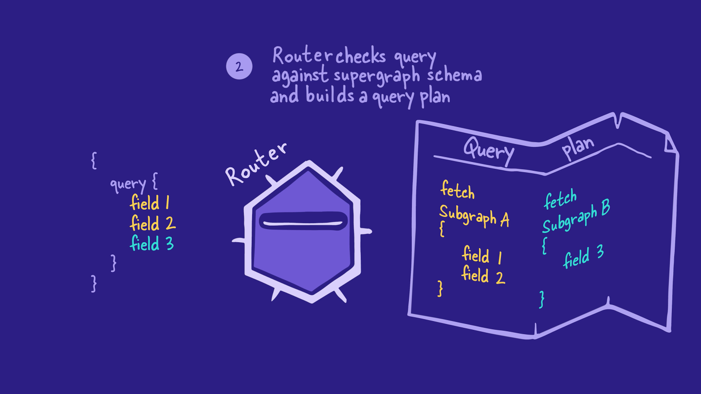

# Odyssey Voyage I

In this project we have two services: locations and reviews,

To create supergraph and combine this services to one we need to convert service to a subraph

1. need to isntall `npm install @apollo/subgraph`

2. Add this to .graphql file in your project `extend schema
@link(url: "https://specs.apollo.dev/federation/v2.0", import: ["@key"])`

3. import `const { buildSubgraphSchema } = require('@apollo/subgraph')`

4. Add `buildSubgraphSchema` to server configuration: `const server = new ApolloServer({
  schema: buildSubgraphSchema({ typeDefs, resolvers }),
});`

## Next step to create supergraph in Apollo Studio and publish our subgraphs

Let's start by spinning up a new supergraph for FlyBy.

1. Open a new browser window and go to GraphOS Studio(studio.apollographql.com
   ).

2. If you haven't created a graph in Studio before now, you'll can get started by clicking Connect a GraphQL API.

Otherwise, we can click the + Create New Graph button in the upper right corner of the Graphs tab.

studio.apollographql.com

3. We'll give our graph a descriptive title, keep the default settings for Graph Architecture as "Supergraph", then click Next.

Storing GraphOS environment variables
To publish our subgraphs using Rover, we'll need to save two environment variables from Studio:

APOLLO_KEY: An API key for authenticating Rover. It starts with something like service:your-graph-name.
APOLLO_GRAPH_REF: The graph reference (or graph ref) for our supergraph, which we'll use to tell Rover where to publish our subgraphs.
A graph ref starts with the graph's ID, followed by an @ symbol, followed by the graph variant.
We can get the values for APOLLO_KEY and APOLLO_GRAPH_REF out of the publishing options modal in Studio.

Go back to the configuration options in Studio that appeared after you created your supergraph. Make sure you're on the Schema Document tab.

First, make sure that the Supergraph Pipeline Track dropdown is set to Federation 2.7 Supergraph. This specifies that our supergraph should be built using the latest features of Apollo Federation.

Below, take a little peek at the command for publishing a subgraph schema. We'll be running this command shortly, but for now, we're more interested in the APOLLO_KEY environment variable here.

APOLLO_KEY=your-graphs-apollo-key \
rover subgraph publish your-graph-name@current \
 --name products --schema ./products-schema.graphql \
 --routing-url http://products.prod.svc.cluster.local:4001/graphql
Click on the eye icon on the code block to reveal the full value of APOLLO_KEY. Copy APOLLO_KEY and its value to your clipboard.

Back in our code editor, we'll create a new file in the router directory called .env.

Paste your APOLLO_KEY into router/.env.

router/.env
APOLLO_KEY=your-graphs-apollo-key
Now let's go back to Studio to get our graph ref. The value we're looking for appears in the same code block, directly after the "rover subgraph publish" part of the command. We'll copy this value onto our clipboard.

APOLLO_KEY=your-graphs-apollo-key \
 rover subgraph publish your-graph-name@current \
--name products --schema ./products-schema.graphql \
 --routing-url http://products.prod.svc.cluster.local:4001/graphql
Note: Our graph ref uses the current variant for our supergraph, which is the default variant. We'll talk more about variants in Voyage III: Federation in Production.

In your router/.env file, add a new line and set your APOLLO_GRAPH_REF environment variable:

router/.env
APOLLO_KEY=your-graphs-apollo-key
APOLLO_GRAPH_REF=your-graph-name@current

We've got the values we need to publish our subgraphs!

The rover subgraph publish command
Rover has a command ready to help us with this important task: rover subgraph publish. This command pushes the latest version of a single subgraph schema to GraphOS.

rover subgraph publish <APOLLO_GRAPH_REF> \
 --name <SUBGRAPH NAME> \
 --schema <SCHEMA FILE PATH> \
 --routing-url <ROUTING URL>
To use this command, we need the graph ref for the supergraph we want to publish to and the following command line options:

Option What is it?
--name What we want to call our subgraph in GraphOS
--schema The relative path to our subgraph's schema file
--routing-url The URL where our subgraph runs (locally, for now)
We'll fill in these options with the details for each of our subgraphs.

✏️ Publishing the locations subgraph
Let's see this command in action by publishing our locations subgraph.

Bounce back to the terminal and make sure we're in the root directory for the project.

Now let's type out the rover subgraph publish command:

We'll paste in the value of our APOLLO_GRAPH_REF environment variable.

For the name option, we'll pass in locations.

For the schema option, we'll pass the relative path to our locations.graphql file.

And for the routing-url option, we'll pass in localhost:4001.

rover subgraph publish <APOLLO_GRAPH_REF> \
 --name locations \
 --schema ./subgraph-locations/locations.graphql \
 --routing-url http://localhost:4001
Note: We've used the \ character in this command to improve legibility by putting each command-line option on its own line. If you choose to type the entire rover subgraph publish command on a single line, you don't need to include the \.

After running the command, you'll see the following message:

The host `localhost` is not routable via the public internet.
Continuing the publish will make this subgraph reachable in local environments only.
Would you still like to publish? [y/N]
Type in y to allow it. We're in tutorial land and working in local environments for now!

Note that you'll need to do this after every subgraph schema publish command.

If all is well in the world, running this command should output a message confirming that the subgraph has been published and the supergraph has been updated!

# Key takeaways

We can use the rover subgraph publish command from the Rover CLI to publish our subgraph schemas to the Apollo schema registry.
Whenever a new subgraph schema is published, GraphOS composes a new supergraph schema with any subgraphs registered to our supergraph.
The supergraph schema consolidates all the types and fields across our published subgraphs. It also includes extra directives to help the router determine which subgraphs can resolve each field.

`Client - request - Router (Supergraph Schema) - Subgraphs`

`[Client] <--Sends Queries/Mutations--> [Apollo Client]
[Apollo Client] <--Sends Requests--> [Apollo Gateway]
[Apollo Gateway] <--Forwards Queries--> [Service A (Apollo Server)]
[Apollo Gateway] <--Forwards Queries--> [Service B (Apollo Server)]
[Service A (Apollo Server)] <--Resolves Queries--> [Apollo Server]
[Service B (Apollo Server)] <--Resolves Queries--> [Apollo Server]
[Apollo Gateway] <--Schema Management--> [Apollo Studio]`

Router use supergraph schema to resolve incoming GraphQL operations from the client.

## Step 1: The client request

First, the client sends a GraphQL operation to the router. The client has no clue which fields belong to which subgraphs—or even that there are subgraphs at all!

Client -> `{
query {
field 1
field 2
field 3
}
}` -> Router

## Step 2: Building a query plan

Router checks query against supergraph schema

It uses this information to build a query plan, a list of smaller GraphQL operations to execute on the subgraphs. The query plan also specifies the order in which the subgraph operations need to run.

## Step 3: Executing the query plan

Next, the router carries out the query plan by sending the smaller GraphQL operations to each of the subgraphs it needs data from.
