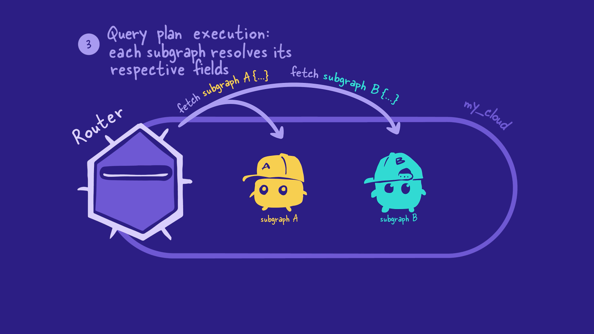
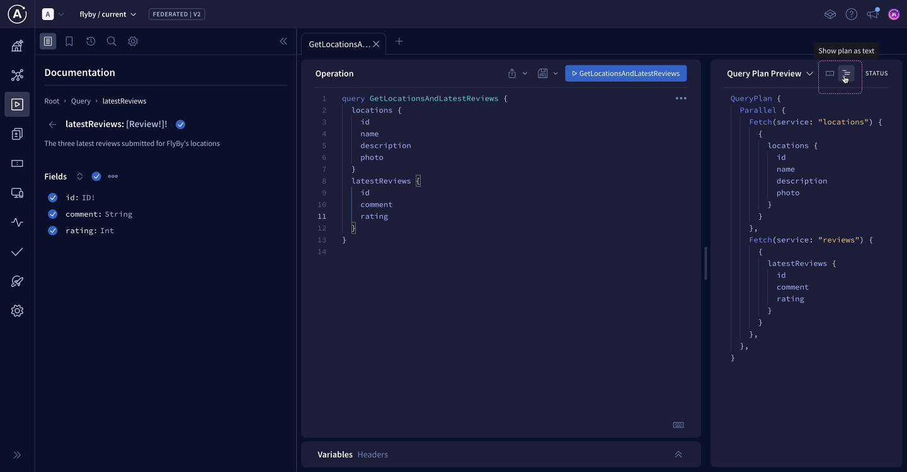

# Odyssey Voyage I

In this project we have two services: locations and reviews,

To create supergraph and combine this services to one we need to convert service to a subraph

1. need to isntall `npm install @apollo/subgraph`

2. Add this to .graphql file in your project `extend schema
@link(url: "https://specs.apollo.dev/federation/v2.0", import: ["@key"])`

3. import `const { buildSubgraphSchema } = require('@apollo/subgraph')`

4. Add `buildSubgraphSchema` to server configuration: `const server = new ApolloServer({
  schema: buildSubgraphSchema({ typeDefs, resolvers }),
});`

## Next step to create supergraph in Apollo Studio and publish our subgraphs

Let's start by spinning up a new supergraph for FlyBy.

1. Open a new browser window and go to GraphOS Studio(studio.apollographql.com
   ).

2. If you haven't created a graph in Studio before now, you'll can get started by clicking Connect a GraphQL API.

Otherwise, we can click the + Create New Graph button in the upper right corner of the Graphs tab.

studio.apollographql.com

3. We'll give our graph a descriptive title, keep the default settings for Graph Architecture as "Supergraph", then click Next.

Storing GraphOS environment variables
To publish our subgraphs using Rover, we'll need to save two environment variables from Studio:

APOLLO_KEY: An API key for authenticating Rover. It starts with something like service:your-graph-name.
APOLLO_GRAPH_REF: The graph reference (or graph ref) for our supergraph, which we'll use to tell Rover where to publish our subgraphs.
A graph ref starts with the graph's ID, followed by an @ symbol, followed by the graph variant.
We can get the values for APOLLO_KEY and APOLLO_GRAPH_REF out of the publishing options modal in Studio.

Go back to the configuration options in Studio that appeared after you created your supergraph. Make sure you're on the Schema Document tab.

First, make sure that the Supergraph Pipeline Track dropdown is set to Federation 2.7 Supergraph. This specifies that our supergraph should be built using the latest features of Apollo Federation.

Below, take a little peek at the command for publishing a subgraph schema. We'll be running this command shortly, but for now, we're more interested in the APOLLO_KEY environment variable here.

APOLLO_KEY=your-graphs-apollo-key \
rover subgraph publish your-graph-name@current \
 --name products --schema ./products-schema.graphql \
 --routing-url http://products.prod.svc.cluster.local:4001/graphql
Click on the eye icon on the code block to reveal the full value of APOLLO_KEY. Copy APOLLO_KEY and its value to your clipboard.

Back in our code editor, we'll create a new file in the router directory called .env.

Paste your APOLLO_KEY into router/.env.

router/.env
APOLLO_KEY=your-graphs-apollo-key
Now let's go back to Studio to get our graph ref. The value we're looking for appears in the same code block, directly after the "rover subgraph publish" part of the command. We'll copy this value onto our clipboard.

APOLLO_KEY=your-graphs-apollo-key \
 rover subgraph publish your-graph-name@current \
--name products --schema ./products-schema.graphql \
 --routing-url http://products.prod.svc.cluster.local:4001/graphql
Note: Our graph ref uses the current variant for our supergraph, which is the default variant. We'll talk more about variants in Voyage III: Federation in Production.

In your router/.env file, add a new line and set your APOLLO_GRAPH_REF environment variable:

router/.env
APOLLO_KEY=your-graphs-apollo-key
APOLLO_GRAPH_REF=your-graph-name@current

We've got the values we need to publish our subgraphs!

The rover subgraph publish command
Rover has a command ready to help us with this important task: rover subgraph publish. This command pushes the latest version of a single subgraph schema to GraphOS.

rover subgraph publish <APOLLO_GRAPH_REF> \
 --name <SUBGRAPH NAME> \
 --schema <SCHEMA FILE PATH> \
 --routing-url <ROUTING URL>
To use this command, we need the graph ref for the supergraph we want to publish to and the following command line options:

Option What is it?
--name What we want to call our subgraph in GraphOS
--schema The relative path to our subgraph's schema file
--routing-url The URL where our subgraph runs (locally, for now)
We'll fill in these options with the details for each of our subgraphs.

✏️ Publishing the locations subgraph
Let's see this command in action by publishing our locations subgraph.

Bounce back to the terminal and make sure we're in the root directory for the project.

Now let's type out the rover subgraph publish command:

We'll paste in the value of our APOLLO_GRAPH_REF environment variable.

For the name option, we'll pass in locations.

For the schema option, we'll pass the relative path to our locations.graphql file.

And for the routing-url option, we'll pass in localhost:4001.

rover subgraph publish <APOLLO_GRAPH_REF> \
 --name locations \
 --schema ./subgraph-locations/locations.graphql \
 --routing-url http://localhost:4001
Note: We've used the \ character in this command to improve legibility by putting each command-line option on its own line. If you choose to type the entire rover subgraph publish command on a single line, you don't need to include the \.

After running the command, you'll see the following message:

The host `localhost` is not routable via the public internet.
Continuing the publish will make this subgraph reachable in local environments only.
Would you still like to publish? [y/N]
Type in y to allow it. We're in tutorial land and working in local environments for now!

Note that you'll need to do this after every subgraph schema publish command.

If all is well in the world, running this command should output a message confirming that the subgraph has been published and the supergraph has been updated!

# Key takeaways

We can use the rover subgraph publish command from the Rover CLI to publish our subgraph schemas to the Apollo schema registry.
Whenever a new subgraph schema is published, GraphOS composes a new supergraph schema with any subgraphs registered to our supergraph.
The supergraph schema consolidates all the types and fields across our published subgraphs. It also includes extra directives to help the router determine which subgraphs can resolve each field.

`Client - request - Router (Supergraph Schema) - Subgraphs`

`[Client] <--Sends Queries/Mutations--> [Apollo Client]
[Apollo Client] <--Sends Requests--> [Apollo Gateway]
[Apollo Gateway] <--Forwards Queries--> [Service A (Apollo Server)]
[Apollo Gateway] <--Forwards Queries--> [Service B (Apollo Server)]
[Service A (Apollo Server)] <--Resolves Queries--> [Apollo Server]
[Service B (Apollo Server)] <--Resolves Queries--> [Apollo Server]
[Apollo Gateway] <--Schema Management--> [Apollo Studio]`

Router use supergraph schema to resolve incoming GraphQL operations from the client.

## Step 1: The client request

First, the client sends a GraphQL operation to the router. The client has no clue which fields belong to which subgraphs—or even that there are subgraphs at all!

Client -> `{
query {
field 1
field 2
field 3
}
}` -> Router


## Step 2: Building a query plan

Router checks query against supergraph schema


It uses this information to build a query plan, a list of smaller GraphQL operations to execute on the subgraphs. The query plan also specifies the order in which the subgraph operations need to run.


## Step 3: Executing the query plan

Next, the router carries out the query plan by sending the smaller GraphQL operations to each of the subgraphs it needs data from.



The subgraphs resolve the operations the same way as any other GraphQL server: they use their resolvers and data sources to retrieve and populate the requested data.

## Step 4: The subgraph responses

The subgraphs send back the requested data to the router, and then the router combines all those responses into a single JSON object.


## Step 5: Sending data back to the client

Finally, the router sends the final JSON object back to the client. And that's the end of our operation's journey!


## Recap

Here's the entire journey of a GraphQL operation through the supergraph, summarized in a single diagram:


## Key takeaways

- The router uses the supergraph schema to create a query plan for the incoming GraphQL operation. The query plan is a list of smaller operations the router can execute on different subgraphs to fully resolve the incoming operation.
- The router carries out the query plan by executing the list of operations on the appropriate subgraphs.
- The router combines all the responses from the subgraphs into a single JSON object, which it sends back to the client.

# Setting up the Apollo Router

In this lesson, we will:

- Set up the GraphOS Router locally
- Connect the router to GraphOS
- Send our first query to our supergraph

### Downloading the router

The GraphOS Router is a high-performance graph router available as an executable binary that you can add to your project in a few steps:

1. Open a terminal window and navigate to the router directory in the FlyBy project.

`cd router`

So far, we only have the `.env` file in here with our environment variables.

> 📦 router<br>
> ┣ 📄 .env

2. We'll download the Router by running the install command in the terminal.

`curl -sSL https://router.apollo.dev/download/nix/v1.46.0 | sh`

3. Now when we check the contents of our router directory, we'll see that we have a new file also called router!

> 📦 router<br>
> ┣ 📄 .env<br>
> ┗ 📄 router

### ✏️ Running the router

1. Back in the same terminal window, run the command below. You'll need to replace the <APOLLO_KEY> and <APOLLO_GRAPH_REF> placeholder values with your supergraph's corresponding values from the router/.env file. This command starts up the router locally and tells the router which supergraph to connect to.

`APOLLO_KEY=<APOLLO_KEY> APOLLO_GRAPH_REF=<APOLLO_GRAPH_REF> ./router`

2. We'll see a few lines of router output, and finally a message that our router is running on port 4000, ready to receive queries!

Let's copy this address, we'll need it to set our connection settings in Studio. This tells outside consumers of our API what endpoint they can use to query our schema.

`GraphQL endpoint exposed at http://127.0.0.1:4000/ 🚀`+

### ✏️ Connecting the router to GraphOS

Let's flip back over to Studio.

1. Click on the README tab in the sidebar.

2. Next, tap the Connection Settings link at the top of the page.


3. We'll paste the router address we copied (http://127.0.0.1:4000) as the endpoint, then save.


Let's get to querying our supergraph!

### ✏️ Testing our schema

1. Select the Explorer tab from the sidebar.

2. Let's put together a query that retrieves data from both of our subgraphs. We'll call our query `GetLocationsAndLatestReviews`.

3. Now let's fire in some fields. We'll start with `locations`. Click the plus button (⊕) next to Fields to add all the location fields to our query.

Next let's go back and add `latestReviews`, and all the reviews subfields.

Our query should look like this:

```graphql
query GetLocationsAndLatestReviews {
  locations {
    id
    name
    description
    photo
  }
  latestReviews {
    id
    comment
    rating
  }
}
```

4. Before we run the query, let's change the Response dropdown on the right to Query Plan Preview. This shows us a diagram for the query plan the router will use to resolve our current operation.


5. By choosing the icon to Show plan as text, we'll see a more detailed breakdown of the query plan. We won't worry about all the syntax here, but we can get a general idea of how the router plans to handle this query: the `locations` subgraph will resolve the `locations` fields, and the `reviews` subgraph will handle `latestReviews` and its subfields.



6. Now let's run this query.


### JSON response

```json
{
  "data": {
    "locations": [
      {
        "id": "loc-1",
        "name": "The Living Ocean of New Lemuria",
        "description": "Surviving is usually extremely difficult, especially when nutrients are scarce and you have to choose between growing or reproducing. One species on this planet has developed a nifty method to prepare for this. Once full matured, this species will split into 2 versions of itself and attached to each other, so it's essentially reproducing. Once those 2 are fully grown, they newly grown version will either detach itself if enough nutrients are available or it becomes a storage unit for the original, if nutrients are scarce. If nutrients continue to be scarce, the original will use slowly consume the nutrients in the new version in the hope that new nutrients become available again and it can repeat the cycle.",
        "photo": "https://res.cloudinary.com/apollographql/image/upload/v1644381344/odyssey/federation-course1/FlyBy%20illustrations/Landscape_4_lkmvlw.png"
      },
      {
        "id": "loc-2",
        "name": "Vinci",
        "description": "Many of the creatures on this planet have evolved into gliders, so to speak. Most of the fish and aquatic mammals, despite coming in various shapes and sizes, tend to glide through the water without effort, similar to how manta's glide on Earth. However, the surface species are more astonishing. Similar to the flying squirrels or the vultures of Earth, many of the species on this planet have developed ways to effortlessly move from one place to another by using the winds. But there is one species which shows signs of sentience. These species, a type of bird, love to play and have become masters of flight. Similar to how dolphins play, explore and learn, these species use their intellect and courage to play and sometimes challenge each other to death defying tricks.",
        "photo": "https://res.cloudinary.com/apollographql/image/upload/v1644381349/odyssey/federation-course1/FlyBy%20illustrations/Landscape_15_tiqel5.png"
      },
      {
        "id": "loc-3",
        "name": "Asteroid B-612",
        "description": "Nutrients are always needed but not always around, so organisms have to find ways to get them. Common ways are using different roots to find them in deep or shallow grounds or even stealing them from others, but on this planet many species have found a different balance. Unlike most plants on Earth who tend to only produce oxygen and nutrients, usually in the form of sugars, for itself, the organisms on this planet also produce other forms of nutrients for itself, usually for different purposes. These processes often lead to many byproducts which it doesn't need and are thus discarded. These discarded products are exactly what other species need to live and in turn produce byproducts it discards for the other organisms, leading to a delicate balance.",
        "photo": "https://res.cloudinary.com/apollographql/image/upload/v1644381343/odyssey/federation-course1/FlyBy%20illustrations/Landscape_6_vt6y3v.png"
      },
      {
        "id": "loc-4",
        "name": "Krypton",
        "description": "Similar to the surface, the underwater world has little more to offer than basic lifeforms. However, this planet has an astonishing water world. Almost everything is covered in a type of sea-grass. This grass varies in length depending on the region, but they're all part of the same species. But what's probably more surprising are the 'flowers' you'll find in these fields of sea-grass. These flowers can only be described as primitive soft corals, but they're neither coral nor plant.",
        "photo": "https://res.cloudinary.com/apollographql/image/upload/v1644381344/odyssey/federation-course1/FlyBy%20illustrations/Landscape_9_kbenjj.png"
      },
      {
        "id": "loc-5",
        "name": "Zenn-la",
        "description": "The plant-like organisms on this planet are made up of millions of flowers. Their combined colors and scents make for an amazing spectacle, but they leave little space for other species, which is why there are only very few bush and shrub species. Fungi, grasses and trees are non-existent.",
        "photo": "https://res.cloudinary.com/apollographql/image/upload/v1644381346/odyssey/federation-course1/FlyBy%20illustrations/Landscape_8_zd1e68.png"
      }
    ],
    "latestReviews": [
      {
        "id": "rev-8",
        "comment": "This is simply unbelievable! It's the perfect solution for our business. Really good. I don't always clop, but when I do, it's because of planet",
        "rating": 5
      },
      {
        "id": "rev-9",
        "comment": "Planet is exactly what our business has been lacking. It's incredible. If you want real marketing that works and effective implementation - planet's got you covered.",
        "rating": 5
      },
      {
        "id": "rev-10",
        "comment": "Thanks planet! I was amazed at the quality of planet. Planet did exactly what you said it does.",
        "rating": 5
      }
    ]
  }
}
```

> Fantastic! We can see that the data object in our response contains both locations and reviews.

> This is huge. We've just unlocked one of the powers of our supergraph: we can write one query to our router and hit both subgraphs at once!
